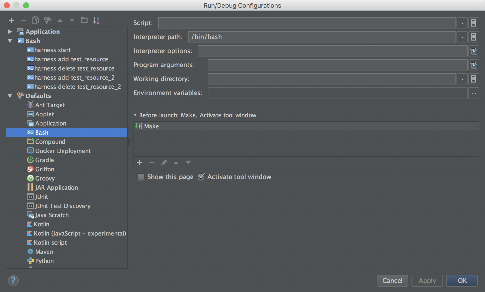
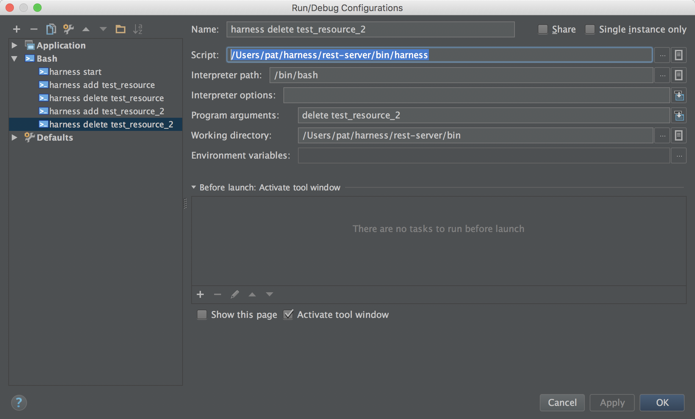
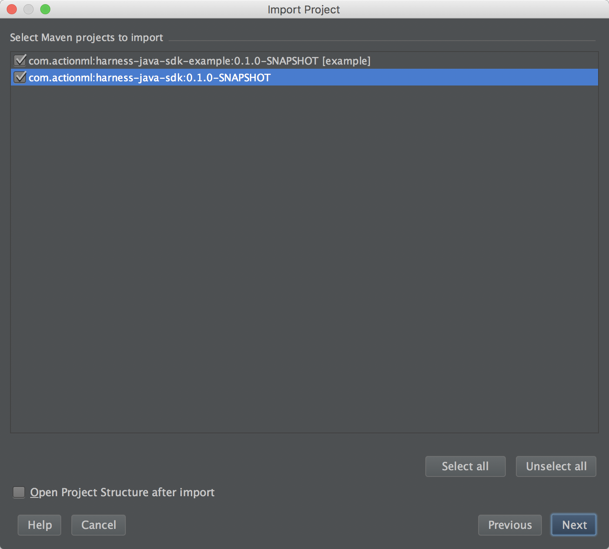

# Debugging with IntelliJ

To debug we will run inside of IntelliJ. This makes `harness start` impossible to use but other commands can be run by executing the CLI inside of `bin/`. First create 2 IntelliJ projects. 

```
git clone https://github.com/actionml/harness.git harness
```

## Debugging the Harness Server

The Harness Server can be debugged with the Harness CLI or by sending event and/or queries from something like the Java SDK all from with the Server setup.

 1. Lunch IntelliJ and pick File -> New -> Project from existing sources. Navigate to `harness/rest-server`, pick import using SBT and finish. You will now be able to run the server, trigger CLI, and the simple examples in the Java SDK project.
 2. Setup CLI debugging:
  - To debug the CLI bring up the "edit debug configurations" pick Bash applications and set the working directory to your equivalent of `/Users/pat/harness/rest-server/bin` This will then be set for all Bash commands
 - Create a debug config for bash the looks like:
   
 - `harness start` This is the only CLI that does not trigger from Bash. Set it up like this:
  
 - `harness delete <resource-id>` and the other CLI can be set to trigger using our bash defaults and setting the specific options needed. For example:
  
  this will perform the equivalent of `harness delete <resource-id>`. as you can see I have created add and delete of 2 different engines for testing.
  - **Note**: This is quite setup correctly yet but should work. Input for the Java SDK example. We have scripts that will compile the example and launch it. The scripts take parameters to control what event json is sent to the server among other things. To input event json, fir launch the server as shown above then run the following Bash run config (notice the working directory is different than other Bash CLI commands.
  

## Debugging the Java SDK and Examples

 1. Lunch IntelliJ and pick File -> New -> Project from existing sources. Then navigate to `harness/java-sdk`, pick import using Maven, and check the "search for projects recursively". When you hit next you will see:

  
 
 If you don't see 2 projects something is wrong, there should be the SDK itself and and examples project.

 2. Finish importing. You will be able to launch the examples in `harness/java-sdk/example` using typical methods but since the SDK communicates with the Harness Server make sure it is running.

