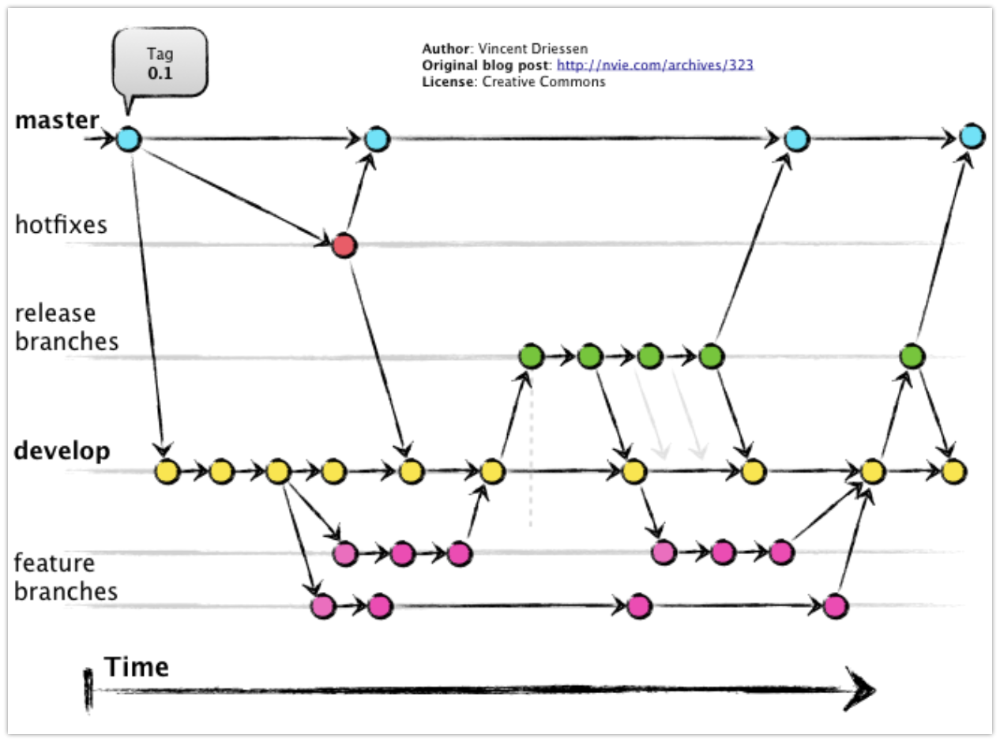

# Harness Dev and Release Process

Harness uses Git for source control and follows a container-first release process using CI/CD. Source builds and some release to nexus and other public artifact eco-systems is also supported.

The project follows the [git-flow](https://nvie.com/posts/a-successful-git-branching-model/) branching model for source control. The primary features of this are infrequent merges of code with the master branch that are tied to releases and a long lived develop branch for works in progress.

# Git-flow

Git-flow defines two main repo branches with an infinite lifetime:

 - **master**; main branch where the source code always reflects a production-ready state
 - **develop**: always reflects a state with the latest work-in-progress teowards the next release. When the source code in the develop branch reaches a stable point and is ready to be released, all of the changes will be merged back into `master` and then tagged with a release number.

Along with these branches several subtrees are also maintained for more specific purposes:

 - **feature**: a branch is created under `feature` for each new feature. We start it from develop and once we’re done, merge back. Example `feature/json-env` might contain new features in the JSON parser.
 - **bugfix**: a branch is created under `bugfix` to be merged with develop. Same as the `feature` branches but separated for bug visibility. Example: `bugfix/db-indexes` which fixes an index bug. 
 - **release**: starts from develop and signifies that there will be a new release once we merge this branch into master. Example `release/0.4.0` which may be tagged with several RCs on its way to merging with `master` and `develop` was a full release.
 - **hotfix**: another subtree used when we need to deliver urgent changes to the deployed master but develop is not yet ready to produce a release branch. Starts from master and merges into both master and develop.
 
# CI/CD

Building docker images and tagging through our automated CI/CD pipeline.

 - tag the docker image with the commit SHA: `actionml/harness:0921e07` (internal use by CI/CD)
 - tag the docker image latest release for the master branch: `actionml/harness:latest`
 - tag the docker image with release version/number (CI/CD takes version from tag, bump file, etc.) for the release branch: `actionml/harness:0.2.0-RC1`
 - tag the docker image develop and with build number from CI/CD (optional) for the develop branch: `actionml/harness:develop`

Created when doing a custom image for some special purpose&mdash;these are NOT created by the automated CI/CD pipeline.

 - custom tags from any tags above if we need a special image

Possible tags include:

 - `actionml/harness:latest` The latest stable release 
 - `actionml/harness:0.4.0` harness-0.4.0 release, may even be the same as `latest`
 - `0.2.0-RC1`, `0.3.1-RC1`, `0.4.0-RC2` older versions, all matching git tags.
 - `develop` the latest work-in-progress from the `develop` branch. This is often used for image pulls when (re)deploying a SNAPSHOT of of the current non-finished, possibly non-stable version.  
 - `0921e07`, `84cd773` work-in-progress versions matching various develop branch commit numbers.
 - `test`, `valerii-test`, `0.1.0-RC1-debug` various hand made images for special purposes.

# "Container First" Releases

Our release policy is to create Docker Container Images as release artifacts. These are published for both works in progress, releases, as well as occasional custom builds for specific purposes. Most people will want to use the image tagged as `actionml/harness:latest` which corresponds to the git tag for the latest stable release number.

Build-from-source using git repo source and/or tarballs that are pre-packaged source, may also be supported for OS level installations but are not the primary goal of Harness releases. Since the automated image releases are built from this same source it is also likely to be available.

# Companion Projects

Several companion projects are maintained to round out the extended Harness system:

 - **[harness-cli](https://github.com/actionml/harness-cli)**: contains the command line interface for harness and is the temporary home of the Python client SDK. This is published in source and packaged in a Docker Container.
 - **[python SDK](https://github.com/actionml/harness-cli)**: a client SDK for python included in the cli, WILL be published to PYPI but currently can be installed on your host using source.
 - **[java SDK](https://github.com/actionml/harness-java-sdk)**: contains a client to use if your app is Java or Scala. It is published into the Nexus eco-system.
 - **[Harness Auth-server](https://github.com/actionml/harness-auth-server)**: This contains the micro-service that manages Authentication and Authorization when it is used in Harness. The "common" module is required to build Harness and so is published into the Nexus eco-system for use with `sbt` as “com.actionml” %% "harness-auth-common” % “0.3.0" [here](https://mvnrepository.com/artifact/com.actionml/harness-auth-common_2.11/0.3.0) See the git project for more details.
 - **Docker-compose, Kubernetes**: several projects that integrate systems of Containers for vertical scaling (Docker-compose) and horizontal scaling (Kubernetes) are also available but are private since they are difficult to support as public OSS. [Contact us](mailto:support@actionml.com) for access.
