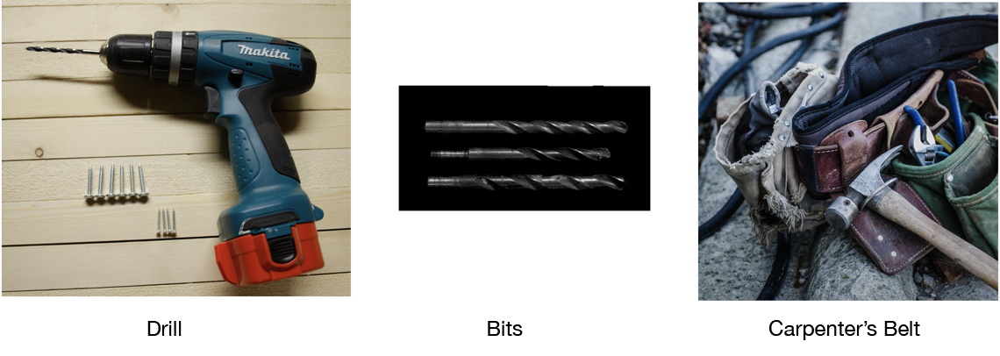
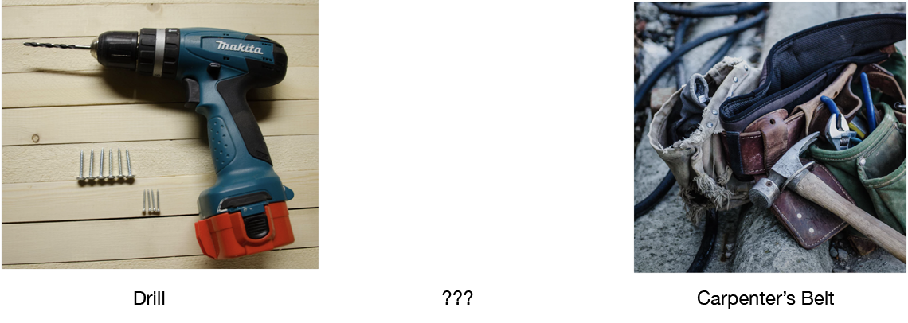
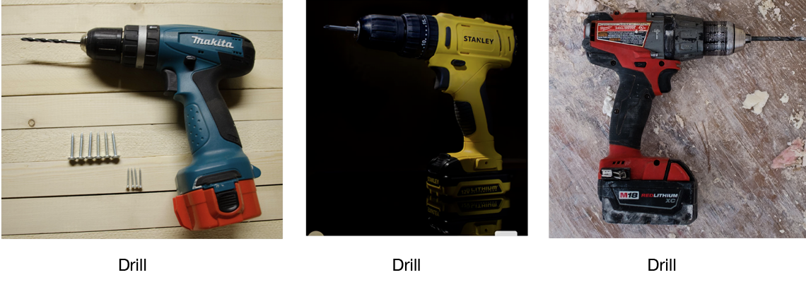

# Recommendations for Complementary Items

The Universal Recommender typically takes input that allows personalized recommendations to be made and also supports item-based and item-set based recs. This use can be seen because ALL indicators/events have a user-id that joins the data. It is used to model user behavior. Item and item-set similarity is in terms of the user behavior

But what if you want to find missing items in a set? This is not a question of user preference so much as what things typically go together. In Machine Learning this is often called ***Complementary Item*** since the items complement each other.

Let's look at a "Complete" group of items that complement each other:

## Complete Complementary Item Group 

Imagine that the data shows these are most commonly purchased together. Now take one away:

## Shopping Cart in Progress

If these were inside a user's shopping cart the question is "what is missing?" The best answer comes from Complementary Items analysis.

Fortunately the data for this is often easy to obtain if we have personalized recommendation data. All we need to do is identify the groups, which is often done with shopping-cart-ids. The Universal Recommender can identify items that form groups and the items that are most likely missing from those groups.

The data for personalized recommendations that is input into the UR is basically (user-id, "conversion-indicator", item-id). This input comes into Harness and to the UR encoded in indicator events. If we substitute a group-id, like a shopping-cart-id, in place of a user-id we have all we need to create a ***Complementary Items*** model. Then as the user fills up a shopping cart we can answer the question; "what is missing?". In the incomplete group above the answer should be a "drill bit set"

To accomplish this we need a new dataset and model. We create a new Engine Instance for the UR and input one indicator for "add-to-cart" which encodes the data (group-id, "add-to-cart", item-id). This is sent as input to the UR for Complementary Items (not the one for Personalized Recommendations). Once we train the Engine Instance we make an item-set query with the item-ids currently in the user's shopping cart.

The result will be a list of items most likely to be purchased along with these current contents. In the example above the "drill bit set" will be returned.

***Complementary Items*** has uses beyond ECom shopping carts but should not to be confused with ***Similar Items***. The item-set based queries of the UR's personalized model return items that have the same user behavior attached to them. Put another way, the items are similar in terms of user behavior. When item-set based queries are made on a the UR's Personalized Recommendations model, you will get very different results.

Both of these results may have a place in your application, but be aware of how an item-set query works depends on the model it is executed against. 

 - **Complementary Items**: use a model built from input based on grouped items with group-ids rather than user-ids
 - **Similar Items**: use the same model built for personalized recommendations with user-ids in the input data