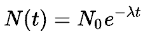

# Navigation Hinting

This Harness Template tracks user navigation events for a site or app and recommends the navigation id that most is most likely to lead to a conversion. These ids can be thought of as conversion hints and are typically used to emphasize some navigation in the UX.

## UX Recommendations

To make the UX uncluttered and more self explaining:

 - It is recommended to exclude hinting from common navigation elements like menus, sidebars, footers, and mobile app navigation placeholders&mdash;otherwise they may be hinted all the time as much more common paths to conversions.
 - Hint a limited number of nav ids (one?) even though more than one may be returned.
 - When possible a hover tool-tip may be useful to describe the hint purpose.

## Algorithm

The algorithm is simple and comes in 2 flavors:

 - **Non-personalized**: this shows the most popular nav event for all users who convert. It will work best until there are enough conversions to differentiate personal journeys to conversion.
 - **Personalized**: this works like non-personalized but find conversion journeys most similar to the journey of the current user. **Note**: this is planned for Hinting V0.2.0 

The Engine provides application or web site owners a way to nudge a user along a proven successful path to conversion. It adapts to changes in navigation on app or site automatically given time. If the app has a major redesign the Engine can be reset to start fresh.

## Algorithm Details for Non-Personalized Hints

User navigation events are collected in a queue of fixed but configurable length until a conversion occurs. Then this "journey" is treated as a training journey. Meaning it is used to create the model of successful journeys. The queue events are down-weighted based on how old they are. This "decay function" is configurable. The simplest/default method uses nav event ordering with 1/(number of nav events till conversion). In other words the further the nav event is from the conversion, the lower it will be weighted in importance to the conversion. The number of events collected means that some are dropped if no conversion happens for a long time so those dropped events are assumed to have nothing to do with the conversion.

Periodically the Engine takes all conversion paths and refreshes the model so there is no need to explicitly "train" the model. The model is created by summing all conversion vectors and ranking the resulting aggregate path vector. When a user navigates to a page the Engine is queried with a list of "eligible" links. The Hinting Engine returns the highest weighted eligible link. This will result in an arbitrary number of pages with no hints if they do not appear in the conversion journeys. 

## Decay Functions

There are other possible weighting decay functions that can be tested with cross-validation from site data including:

 - **Clicks to Conversion ("click-order")** this is the default if not specified and is simply 1/(number of clicks to conversion), so (1, 0.5. 0.3333, 0.25,...) This method does not use the timestamp of events only the order of the sequence.
 - **Exponential Decay ("half-life")** better know as the half-life method. This uses the time stamps of each event and decays the weight by  "t" is the length of time until conversion, "&lambda;" is the [decay constant](https://en.wikipedia.org/wiki/Exponential_decay). The larger &lambda; the faster the decay. This param is set to the number of days at which time the event will have 1/2 the weight it had to start with. So always express this in number of days. The default is &lambda; = 1.0 day.
 - **Time to Conversion ("click-times")** this uses the time of the event to decay its weight as 1/(time till conversion). The time is calculated as a duration at the time a user converts. In other words it is the inverse of the time from the occurrence of the event until the user converts.

The model generated will be the sum of all weighted conversion vectors, ranked by summed weight. When a query is made, the highest weighted eligible navigation ids are recommended. Here **eligible** nav events are specified with each query by enumerating nav events that can be hinted by the app.

The score has no absolute meaning an is only used to rank the eligible events by the highest value.

## Personalized Algorithm (Hinting v0.2.0 Planned)

The Personalized version is similar to the non-personalized and has the same configurable decays and other parameters. The decay function here acts as a threshold to detect events that are too old to consider. This threshold is applied to both the user's current journey and the data used to calculate the cooccurrence model. After passing this threshold LLR is used to find the most likely nav events correlate with a conversion.

The model uses cooccurrence to calculate the most likely conversion links and so is based on the user's current journey history. The hints for a particular user are based on conversion journeys of "similar" users. 

To calculate this similarity quickly in realtime a cosine k-nearest-neighbor engine is used in the form of Elasticsearch in a manner similar to the a simplified CCO algorithm as used in the Universal Recommender with TTL (time to live) applied to all input to model calculation and user history. The TTL is based on the decay function. 

# Input

Input comes in the form of an Event stream via the Harness REST API for POSTing events in JSON form. Insert events in JSON form like so: 

```
curl -i -X POST http://localhost:9090/engines/<engine-id>/events \
-H "Content-Type: application/json" \
-d $JSONHERE
```

This assumes the server is listening on localhost:9090, the default, and the Navigation Hinting Engine is running on `/engines/<engine-id>`. As with any Harness Engine, if TLS/SSL and Auth are turned on using the Java or Python SDK is recommended.

## Navigation Events

User navigation events are the only type of input allowed. These have all information needed to create a model. Journeys internally are keyed to the user-id so the only exception to the usage event is the $delete event for removing any stored User Journey data. 

Nav Events are encoded:

    {
        "event" : "nav-event",
        "entityType" : "user",
        "entityId" : "pferrel",
        "targetEntityId" : "nav-id",
        "properties" : {
            "conversion": true | false
        },
        "eventTime": "ISO-8601 encoded string"
    }

 - **event**: this must be named "nav-event"
 - **entityType**: this must be "user"
 - **entityId**: this is a user-id
 - **targetEntityId**: this should be a nav-id
 - **eventTime**: ISO-8601 encoded string for the time of the event.
 - **properties**: defined as...
  - **conversion**: true of false, false if omitted.
 - **eventTime**: ISO-8601 encoded string. This is a required field.

As with other Engines to delete any Journey information attached to a user you should `$delete` the User with:

    {
        "event" : "$delete",
        "entityType" : "user",
        "entityId" : "pferrel",
    }

Since the number of Users will increase without bounds some external method for trimming them will eventually be required. Since old inactive users will not generally have meaningful Journeys is they have not converted in a long time, a TTL could be employed if the user's journey has not been modified in some period of time. The Nav Event will re-create the user later if they later become active again. 

**Note**: the TTL is a DB feature and should be added to the Engine's JSON config file (Not done yet). **TBD for v0.1.0.** 

## User Attributes (Non-Personalized)

User Attributes are not used in the non-personalized hinting. The user-id is only used as a key to the journey they are on. Once a user converts, their journey contributes to the model predicting how likely the journey will lead to a conversion.

## Navigation Hinting Query

On the `POST /engines/<engine-id>/queries` endpoint the Engine will respond to the JSON query

```
curl -H "Content-Type: application/json" -d '
{
  "user": "pferrel", // optional and ignored for non-personalized
                     // this is required for personalized hints
  "eligibleNavIds": ["nav-1", "nav-34", "nav-49", "nave-11", "nav-3004". "nav-4098", ...]
}' http://localhost:9090/engines/<engine-id>/queries
```

This will get recommendations for user: "pferrel" but since NavHinting v0.1.0 is non-personlized the user-id will not affect the results. 

```
{
  "result": ["nav-49",...]
}
```

**Note**: The `user` portion of the query only has an effect for personalized hinting, it is ignored otherwise.

# Configuration of Navigation Hinting

The NH Engine has a configuration file defined below. This defines parameters for for the Engine itself, the algorithm, and for Elasticsearch the KNN engine. The parameters effect how fast an NH engine instance will be able to calculate a query response so try the default params and understand the implications before increasing limits. In many case simply increasing values will not provide better results&mdash;for instance increasing `"numQueueEvents"` may only include very low weighted events that are unrelated to conversion but the cost of calculating the model may be high. So this is an example of higher cost for less value. To use default values, simply omit their definition.

```
{
  "engineId": "test_resource",
  "engineFactory": "com.actionml.templates.nh.NavHintingEngine",
  "algorithm":{
    "numQueueEvents": 50,
    "decayFunction": "click-order", // or "half-life" or "click-time"
    "halfLifeDecayLambda": 1.0, // optional, used only with half-life decay function
    "num": 1
  }
}
```

 - **engineId**: used for the resource-id in the REST API. Can be any URI fragment.
 - **engineFactory**: constructs the Engine and reads the parameters, must be as shown.
 - **algorithm**: params known only by the algorithm, which is a part of the Template definition.
  - **numQueueEvents**: number of events stored per user before a conversion. Older events are dropped once this limit is reached and newer ones are added. The default is 50 if omitted.
  - **decayFunction**: Must be one of `"click-order"`, `"click-time"`, `"half-life"`. The `"click-order"` and `"click-time"` functions needs no `"halfLifeDecayLambda"` parameters.  The default is `"click-order"` if omitted.
  - **halfLifeDecayLambda**: defines how quickly the weight of the event diminishes via the equation:  This is only used if the decay function is `"half-life"`. This is a string corresponding to a duration and must be specified if the decay function is `"half-life"`, there is no default. The format for the string is, for example `"4 days"` or `"100 days"`. Days are the largest unit of a duration.
  - **num**: how many of the highest ranking hints to return. Default = 1 if omitted.
 
# Training

Harness was designed for streaming data sources and in the case of the NH non-personalized engine will train for incoming events incrementally so all you need to do is send events and make queries. 

For Personalized Hinting a more heavy weight background process can be triggered periodically that will not interrupt querying or input. This will use Spark and Elasticsearch and is targeted for NH v0.2.0.
